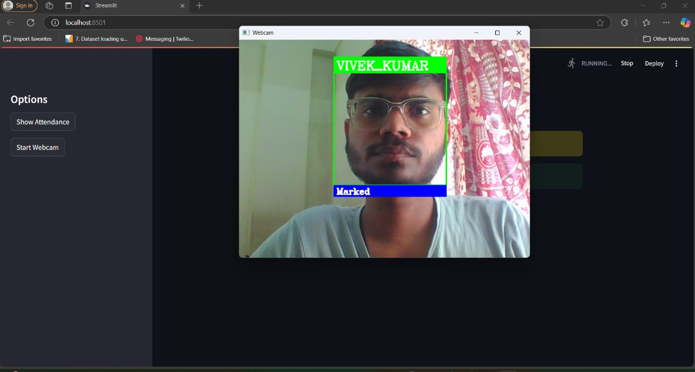

# 🎯 Real-Time Face Recognition Attendance System


---

## 📸 Overview

This project is a real-time face recognition attendance system built using **OpenCV**, **face_recognition**, and **Streamlit**. It detects faces from a live webcam stream and marks attendance automatically.

---

## 🚀 Features

- Real-time face detection and recognition
- Automatic attendance marking with timestamp
- Streamlit-based interactive web application
- Simple UI with sidebar controls
- Displays "Unauthorized" for unknown faces
- Freezes frame briefly after marking to avoid duplicates

---
## Screen Shorts

1. **Landing Page:**


2. **First Time:**


3. **Rest of Time:**


4. **Show Table:**


## 📂 Project Structure


- `student_images/` → Folder containing one clear image per student. Filename = Student Name.
- `streamlit_app.py` → Main application file.
- `Attendance.csv` → Stores attendance records.

---

## 💻 How to Run Locally

1. **Clone the repository:**

    ```bash
    git clone https://github.com/vivekkumarguml/Real-Time-Attendance-System.git
    cd Real-Time-Attendance-System
    ```

2. **Create a virtual environment (recommended):**

    ```bash
    python -m venv dlib_env
    ```

    - Activate the virtual environment:
        - **Windows:**
            ```bash
            dlib_env\Scripts\activate
            ```
        - **Linux/Mac:**
            ```bash
            source dlib_env/bin/activate
            ```

3. **Install required packages:**

    ```bash
    pip install -r requirements.txt
    ```

4. **Run the application:**

    ```bash
    streamlit run streamlit_app.py
    ```

---

## 🧩 Dependencies

- `streamlit`
- `opencv-python`
- `face_recognition`
- `numpy`
- `pandas`

You can generate a `requirements.txt` by running:

```bash
pip freeze > requirements.txt
